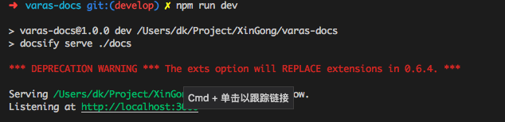

# 首页

具体内容参阅 https://docsify.js.org/#/zh-cn

修改标题可以直接修改index.html文件

这里就不在npm run dev的时候直接打开浏览器了。可以用下图的方法，或者直接在浏览器输入http://localhost:3000

另外需要确定一下这个文档放在自己服务器还是其他服务器，由于是静态资源，可以全部放在github，并开启pages服务。

放在这上面发布的时候,只需要master分支代码更新一下就好了。
...